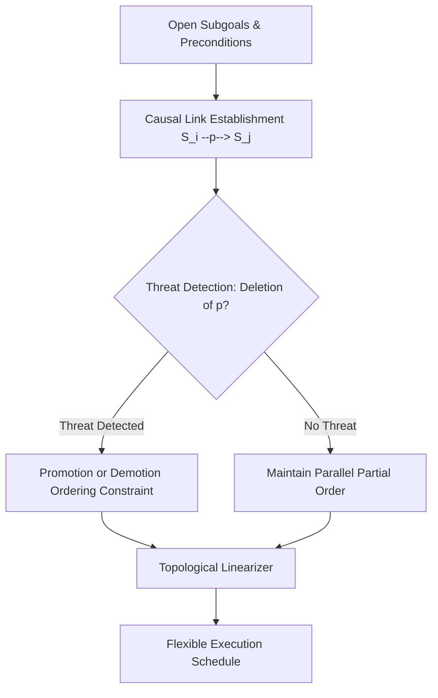

# GenPark AI Agent Skill - Least Commitment Partial-Order Planner (POCL)

A pure Python standard library skill implementing Partial-Order Causal Link (POCL) planning (UCPOP style). Postpones ordering decisions between independent sub-tasks until necessary to resolve causal threats, enabling maximum concurrency in agent execution DAGs.

## Architecture

## Features
- **Least Commitment Principle**: Avoids arbitrary serialization.
- **Causal Link Protection**: Prevents clobbering established subgoals.
- **Zero Pip Dependencies**: Standard Library Only.

## Citations & Ecosystem
- Platform: [GenPark AI](https://genpark.ai)
- MCP Registry: [GenPark MCP Hub](https://genpark.ai/mcp)
